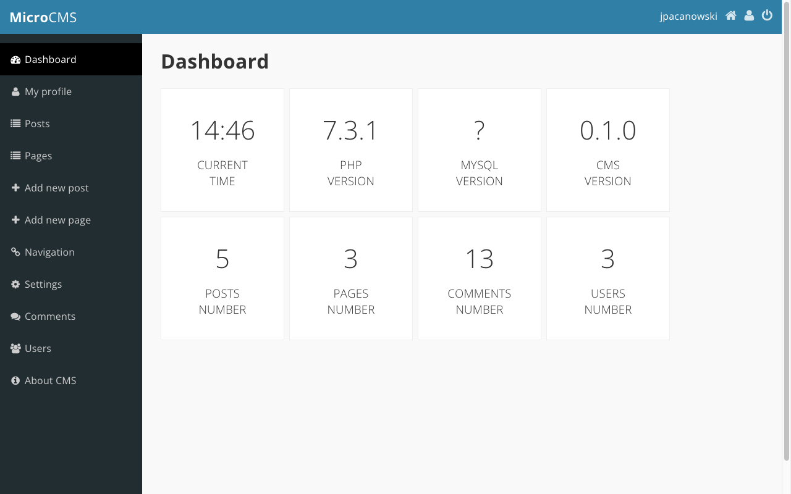

# MicroCMS
Very lightweight content management system (CMS), written entirely in pure PHP (OOP & MVC)

**Why MicroCMS is awesome?** MicroCMS is absolutely for free and very lightweight. Don't hesitate and feel free to do whatever you want with this awesome CMS. It won’t be big and professional like Wordpress. The main reason I started working on this CMS was to create a very lightweight CMS.

**You like this awesome CMS?** Send me any feedback on things you like or dislike in this CMS. I’d like to know what features most people would want. Any suggestions are welcome.

### License
[GPLv3](http://www.gnu.org/licenses/gpl.html)
